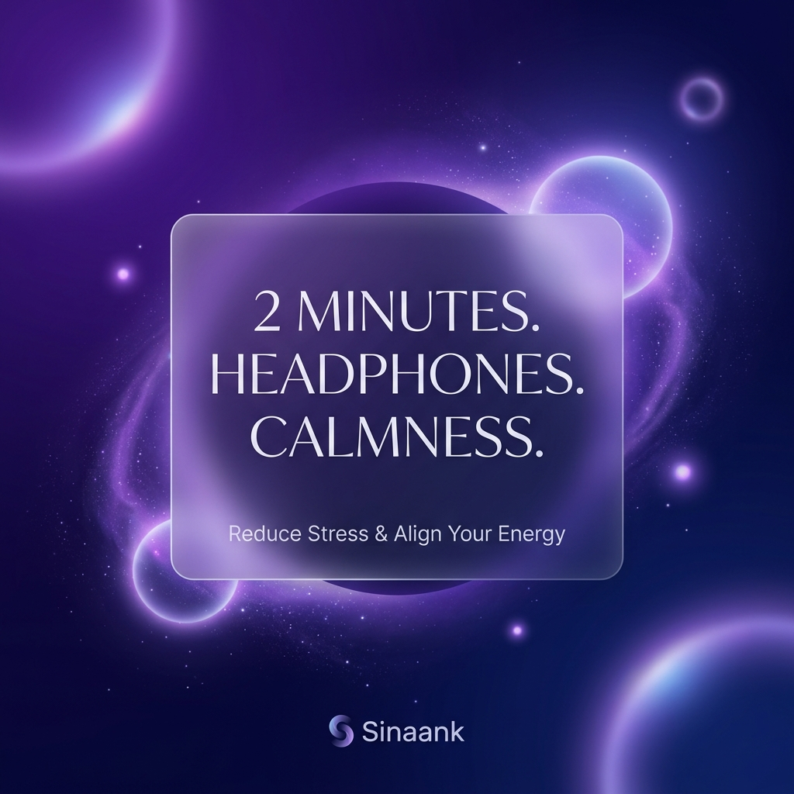
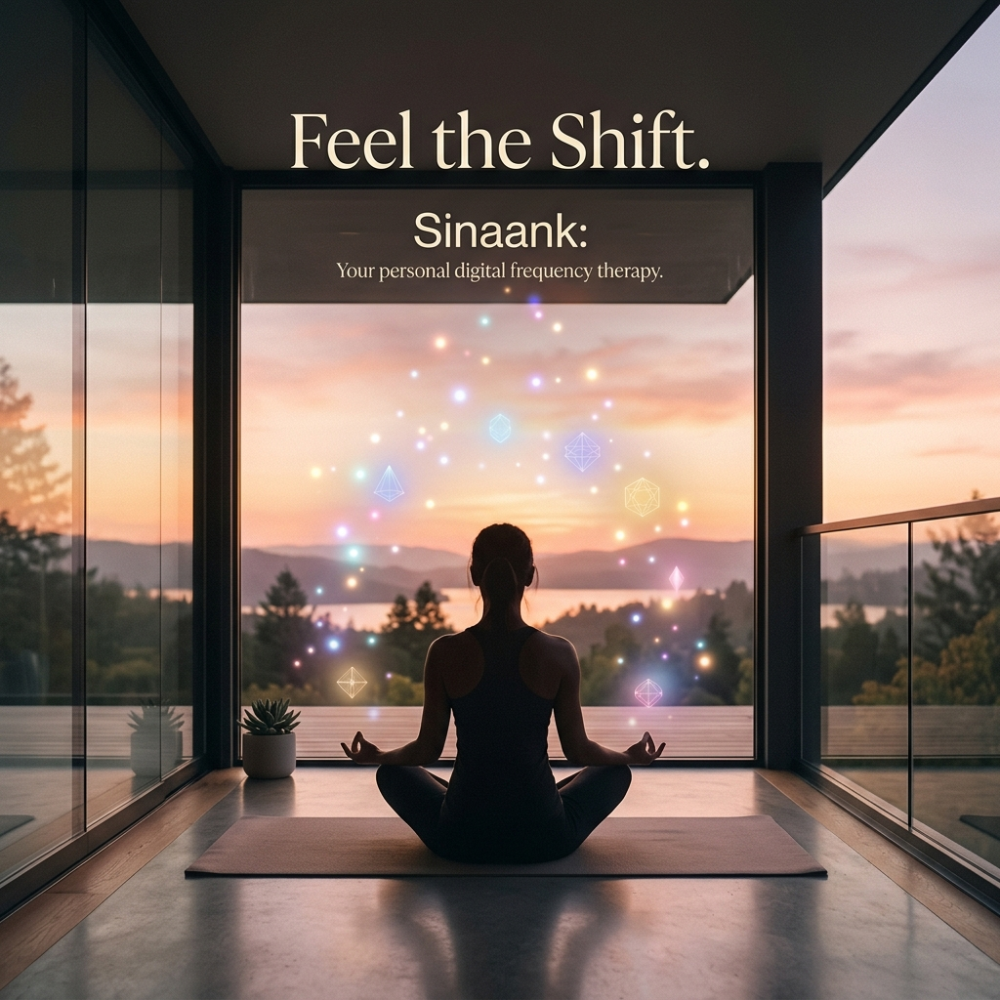

# Sinaank Therapy: Marketing Assets (v1.0)

Aapke vision ke anusar, Sinaank ki marketing "Wellness-First" aur "Emotional-Connection" par focused hogi.

## 1. Marketing Posters

### Poster A: Minimalist Hook

- **Concept**: "2 MINUTES. HEADPHONES. CALMNESS."
- **Usage**: Instagram Stories, WhatsApp Status, Facebook Posts.

### Poster B: Emotional Resonance

- **Concept**: "Sinaank: Feel the Shift."
- **Usage**: Profile pictures, Group sharing, Community posts.

---

## 2. Reel Scripts (Calm & Futuristic)

### Script 1: The "Digital Detox" (15-20 Sec)
- **Visual**: Ek user bahut stressed hai, screens dekh raha hai. Fir woh headphones lagata hai aur ankhein band karta hai. Background mein Sinaank ki frequency dheere-dheere tez hoti hai.
- **Text Overlay**: "24 ghante duniya ke liye... Kya 2 minute khud ke liye hain?"
- **Audio**: Soft ambient noise switching to Sinaank Calm Frequency.
- **CTA**: "Try 2-Minute Free Therapy. Link in Bio."

### Script 2: The "Sleep/Overthinking" (25 Sec)
- **Visual**: Dr. Yogesh (Founder) ek calm setting mein baithe hain.
- **Voiceover**: "Overthinking aapki neend hi nahi, aapki energy bhi chura leti hai. Sinaank koi dawa nahi hai, ye aapki apni frequency ka alignment hai. Aaj raat, sone se pehle sirf 2 minute try karke dekhiye."
- **Visual**: Sinaank App Dashboard showing "Sleep Mode".
- **CTA**: "Feel the shift tonight. Sinaank.com"

---

## 3. Founder Short Message (WhatsApp/Video)

"Ram Ram Ji. Maine Sinaank ko ek mission ke sath banaya hai—taaki har kisi ke paas mental peace ka ek digital button ho. Bina kisi aggressive promotion ke, main chahta hun aap khud ise mehsoos karein. Sirf 2 minute headphones lagaiye aur apni energy ko align hota hua dekhiye. Dhanyavaad."

---

## 4. WhatsApp Status / Story Captions

1. "Duniya ka shor band karke, Sinaank ka sukoon suniye. 🌿 #SinaankTherapy"
2. "Your brain deserves a reset. Try the 2-minute digital frequency therapy now. (Link in Bio)"
3. "₹299 for a lifetime of wellness. Investing in your peace is the best decision."
